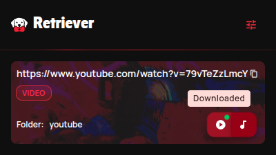
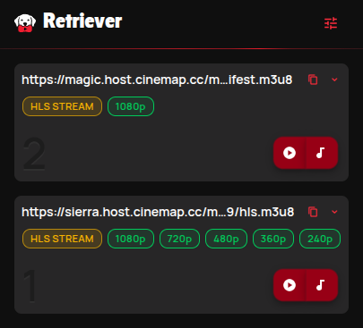
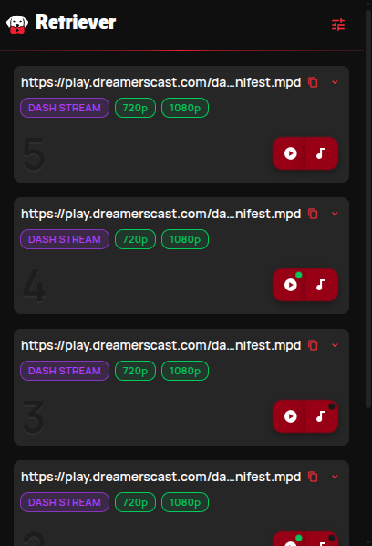
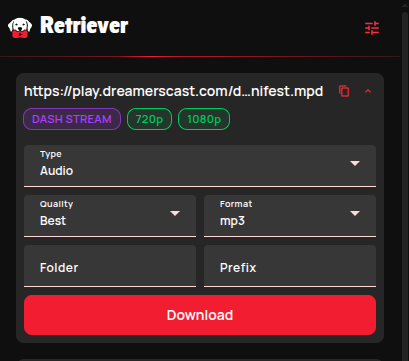

<p align="center">
  
</p>

# 🐕 Retriever — Browser Extension

**Fetch any video on the page with one click and send it straight to your [Retriever](https://github.com/xinua/retriever).**

---

## What is this?

This is the companion browser extension for **[Retriever](https://github.com/xinua/retriever)**, the self-hosted Web UI for `yt-dlp`.

The extension does no downloading itself. It finds what's worth downloading on the page you're looking at and hands it to **your own** Retriever instance, which downloads it into your library. No copy-pasting URLs between tabs.

- 🎬 **On YouTube** — "Download video" and "Download audio" right in the player's menu and on the right-click menu of any video link
- 🌍 **On any other site** — the popup lists the video and audio files and streams the page loads, ready to send
- ⚙️ **Your presets** — quality, format and codec set once, used for every download

Works in **Chrome** (120+) and **Firefox** (142+).

---

  🐕 [Retriever app](https://github.com/xinua/retriever)

  🔒 [Privacy policy](PRIVACY.md)

## 📷 Screenshots



<details>
  <summary>📸 Expand more screenshots</summary>
  <br>
  
  
  
</details>

## ✨ Features


### Download from anywhere

- ▶️ **YouTube player menu** — right-click the player and pick *Download video* or *Download audio*
- 🖱 **Link context menu** — right-click any YouTube video link, thumbnail or Short
- 🔎 **Media detection** — spots `.mp4`, `.mp3`, `.m3u8`, `.mpd` and friends among a tab's network requests, with type and size
- 🧭 **Page URL too** — on any of the thousand-odd sites `yt-dlp` has an extractor for, the page itself is offered as a source
- 🔗 **Referer kept** — sites that refuse downloads without it still work


### Popup

- 🃏 **Media cards** — every source on the page, with its own type, quality, format and codec
- ✅ **Already downloaded?** — the app tells the popup which links you already have
- 📊 **Live progress** over WebSocket while the popup is open
- 🚀 **Open app on download** — optionally jump to Retriever as soon as a download starts


### Options

- 🔌 **Connection check** — enter your app URL once; the extension verifies it before saving
- 🎞 **Video preset** and 🎵 **Audio preset** — defaults for every download
- 📂 **Subfolder per site** — files land in a folder named after the tab's hostname
- 🏷 **Name prefix per source** — filenames get the source's hostname in front
- 🤝 **App bridge** — the Retriever app knows the extension is installed and which version


### Privacy first

- 🙅 **No servers, no analytics, no telemetry** — data only ever goes to the Retriever address **you** entered
- 🔐 **Detection is opt-in** — access to all sites is requested only when you turn it on from the popup
- 🧹 **Short memory** — found media lives in session storage, per tab, cleared on navigation

Full details in the [privacy policy](PRIVACY.md).

---


## 🚀 Installation

> The extension isn't in the Chrome Web Store or on AMO yet, so for now it's a **manual install**.

You need a running [Retriever](https://github.com/xinua/retriever#-quick-start) first.

### Build it

```bash
pnpm install
pnpm build
```

This produces, for each browser:


| Path                                | What it is             |
| ----------------------------------- | ---------------------- |
| `dist/chrome/`, `dist/firefox/`     | The unpacked extension |
| `dist/retriever-<ver>-<target>.zip` | Store-ready package    |


### Chrome

1. Open `chrome://extensions`
2. Turn on **Developer mode** (top right)
3. Click **Load unpacked** and pick `dist/chrome`


### Firefox

1. Open `about:debugging#/runtime/this-firefox`
2. Click **Load Temporary Add-on…** and pick any file inside `dist/firefox` (e.g. `manifest.json`)

Temporary add-ons are removed when Firefox restarts. Or just run `pnpm start:firefox` to launch a Firefox profile with the extension loaded.

### First run

The options page opens on its own after install:

1. Enter your Retriever address, e.g. `http://192.168.1.50:31080`
2. Let the browser grant access to that address when asked — that's how the app bridge talks to the app
3. Tune your video and audio presets

Then open any YouTube video — the download items are already in the player menu. For other sites, open the popup and click **Allow access**.

---


## 🛡 Permissions


| Permission            | Why                                                                  |
| --------------------- | -------------------------------------------------------------------- |
| `storage`             | Your settings and the media found in each tab                        |
| `activeTab`           | Reads the current tab's address when you open the popup              |
| `contextMenus`        | *Download video/audio* on YouTube video links                        |
| `webRequest`          | Recognises media files among a tab's requests                        |
| `webNavigation`       | Clears a tab's media list when it navigates                          |
| `scripting`           | Injects the app bridge into the Retriever app's own pages            |
| *Optional:* all sites | Media detection outside YouTube — asked for only when you turn it on |


---


## 🛠 Development

Angular 22 + Angular Material + Tailwind for the popup and options pages, plain TypeScript bundled with esbuild for the background worker and content scripts. One codebase, two manifests (`manifest/base.json` + `manifest/<browser>.json`).

```bash
pnpm dev              # watch build for Chrome, with live reload
pnpm dev:firefox      # same for Firefox
pnpm build            # production build + zip for both browsers
pnpm build:chrome     # …or just one
pnpm test             # unit tests (Vitest)
pnpm lint             # ESLint
pnpm lint:firefox     # web-ext lint of the Firefox build
pnpm format           # Prettier + ESLint
```

`pnpm dev` runs the Angular watcher, the esbuild watcher and a small live-reload server together. Load `dist/<browser>/` once; after that, popup and options pages refresh themselves, and changes to the manifest, background or content scripts reload the whole extension and re-inject open YouTube tabs.

### Layout

```
manifest/        base manifest + per-browser overrides
scripts/         build, dev and live-reload scripts
src/app/         Angular pages: popup and options
src/background/  service worker: API calls, context menu, media detection, app bridge
src/content/     YouTube player menu and the app bridge content script
src/shared/      code used by both sides (storage, messages, yt-dlp site list)
src/dev/         live-reload clients, stripped from production builds
```

---

**Looking for a feature or found a bug? [Open an issue or a PR!](https://github.com/xinua/rt-ext/issues)**

Part of the [Retriever](https://github.com/xinua/retriever) project.